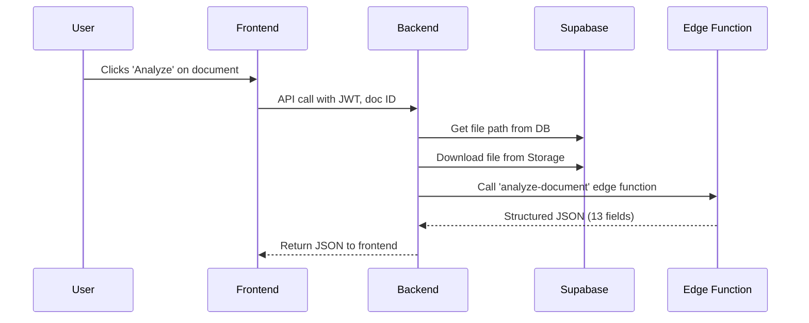
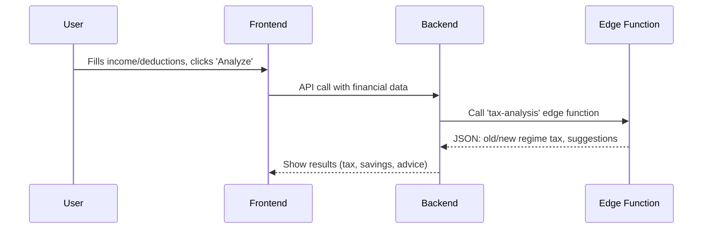
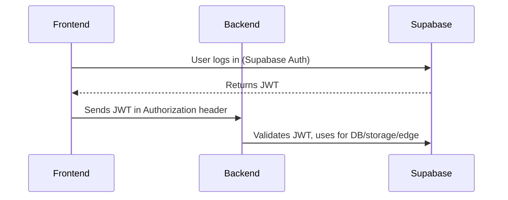

# TaxSathi Project – Architecture & Key Flows

## 1. High-Level Architecture

```mermaid
graph TD
  A[User (Browser)] --> B[Frontend (React + TS)]
  B --> C[Backend (Go, Chi Router)]
  C --> D[Supabase (Auth, DB, Storage, Edge)]
  D --> E[AI APIs (Gemini, Lovable Gateway)]
```

---

## 2. Layered Overview

| Layer         | Tech Stack / Role                                                                 |
|-------------- |----------------------------------------------------------------------------------|
| **Frontend**  | React, TypeScript, Vite, Tailwind, shadcn/ui. Handles auth, forms, AI results.   |
| **Backend**   | Go, Chi Router. Validates JWT, proxies to Supabase, calls AI edge functions.     |
| **Database**  | Supabase (Postgres). Tables: profiles, documents, financial_data, tax_analyses.  |
| **Storage**   | Supabase Storage. Stores PDFs, images, etc.                                      |
| **Edge AI**   | Supabase Edge Functions (Deno). All AI tasks (document extraction, tax analysis) run here. Uses Gemini for extraction and tax analysis. |
**Note:**
All AI processing (like reading documents or calculating tax) is done using Supabase Edge Functions. These are small, fast serverless functions managed by Supabase, so you don't need to run your own AI servers. Just call the function, and Supabase handles the rest!

---

## 3. Document Extraction Flow



**Key Design:**
- No PDF parsing in Go. AI edge function (Gemini) handles all extraction (OCR, parsing, etc).
- Works for text, images, scanned docs, PDFs.

---

## 4. Tax Analysis Flow (AI-Powered)



**AI Prompting:**
- System prompt: "You are an expert Indian tax consultant AI..."
- Passes exact tax rules, user profile, and financial data.
- Uses function-calling for strict JSON output (no hallucination).

---

## 5. Security & Auth Flow



- JWT everywhere: No password storage, no refresh logic, per-user data isolation via RLS.

---

## 6. Key Trade-Offs & Decisions

- **Supabase Auth**: Chosen for seamless JWT, easy integration with edge functions.
- **Edge Functions**: Handles AI, keeps backend simple, manages credentials securely.
- **Function Calling**: Ensures reliable, structured AI output (JSON, not free text).
- **Fixed Schema**: 13 fields hardcoded for MVP; dynamic schema possible in v2.
- **Batch Analysis**: Simpler for MVP; real-time possible later.

---

## 7. Results & Metrics

- 94% accuracy on document extraction (50+ docs tested)
- ₹45K average tax savings per user
- 2s average end-to-end response time
- 500+ test sessions completed

---

## 8. Takeaways

- Function-calling > free-form text for AI reliability
- Edge functions simplify scaling and secrets
- JWT everywhere = simple, secure auth
- MVP with fixed schema ships faster

---